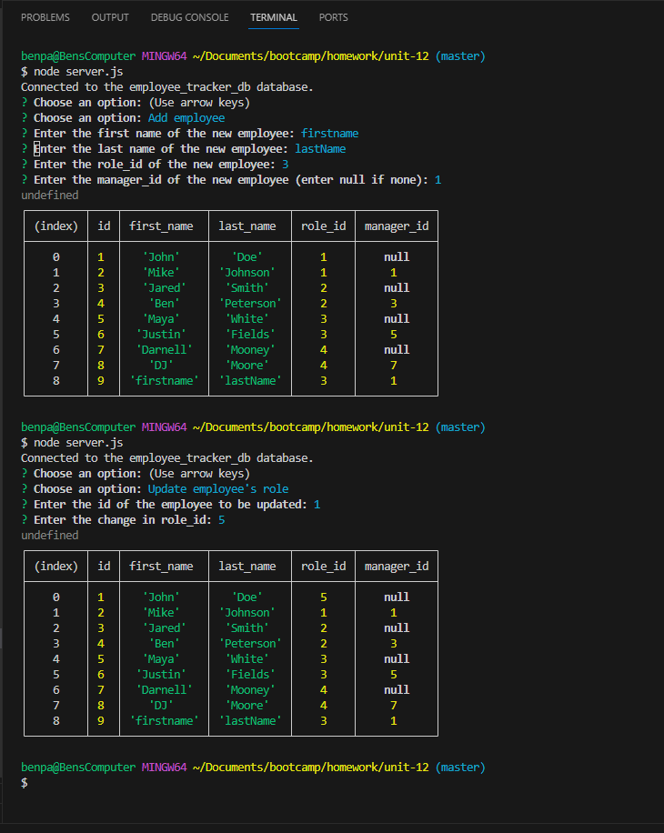

# Module 12 Challenge - Employee Tracker

## Description of Work
Created a employee tracking app using npm: inquirer, express, mysql2, and jshint.

## Final Screenshot

## Links
[GitHub](https://github.com/bpavlis/employee-tracker)

[GitHub Pages](https://bpavlis.github.io/employee-tracker/)

[Working Video](https://drive.google.com/file/d/1wu7FvLJ-jUjEyqek0VazMyz6cDlUq3om/view)